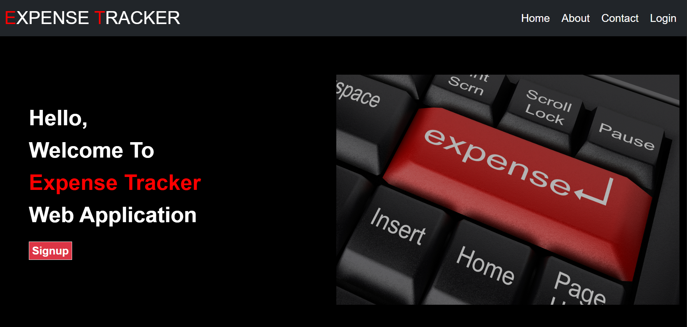
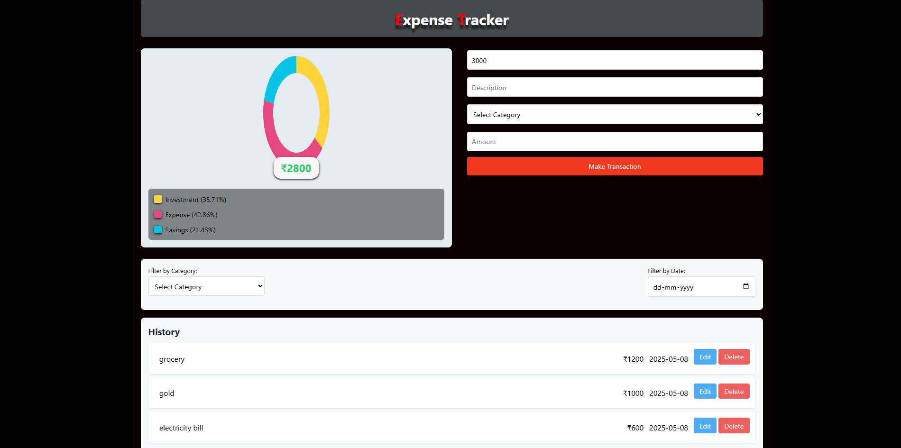

# 💰 Expense Tracker

A minimalist and responsive expense tracking web app with authentication, transaction analytics, and local storage support. Easily add, delete, and filter your transactions while visualizing your spending via an interactive donut chart.

---

## ✨ Features

- 🔐 **User Authentication** – Sign up, log in, and recover passwords
- ➕ **Add/Delete Transactions** – Manage your income and expenses
- 📊 **Interactive Analytics** – Visual donut chart using Chart.js
- 🔍 **Filter System** – Sort transactions by category and date
- 📱 **Responsive Design** – Fully mobile-friendly layout

---

## 📸 Screenshots

### 🧾 Dashboard View  

### 📊 Donut Chart & Filters  

---

## 🎞️ Demo (GIF Preview)

> Place your screen recording as a GIF in `./assets/expense-demo.gif`. Use [ezgif.com](https://ezgif.com/video-to-gif) to convert a video if needed.

---

## 🛠️ Tech Stack

- **Frontend**: HTML5, CSS3, JavaScript
- **UI**: Bootstrap 5, Font Awesome
- **Charts**: Chart.js
- **Storage**: localStorage (No backend needed!)

---

